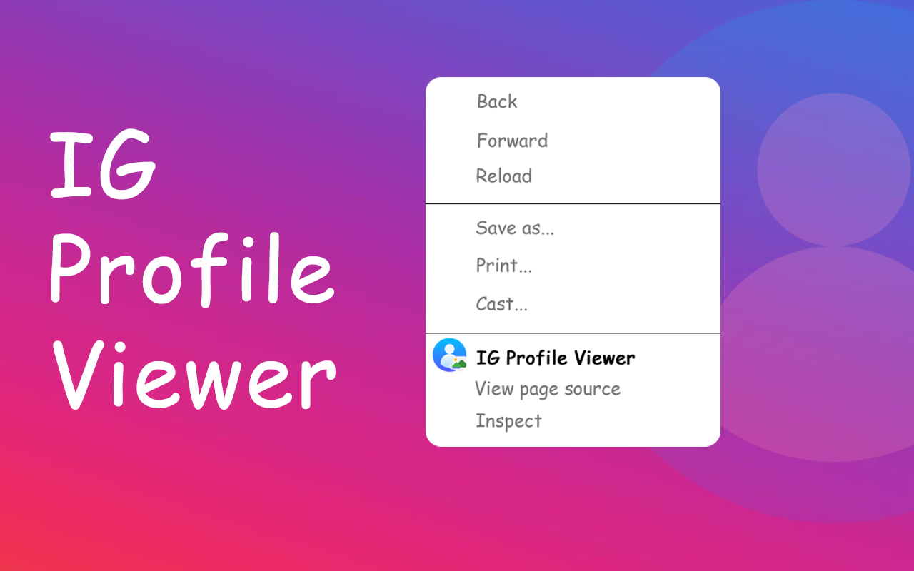

## IG Profile Viewer ⭐️⭐️⭐️⭐️⭐️

IG Profile Viewer: Conveniently View Instagram Profile Pictures

If you enjoy exploring Instagram profiles and want to see profile pictures in full size without using external tools or downloading the image, IG Profile Viewer is the solution you’ve been looking for!

Using IG Profile Viewer is both easy and convenient. Simply install this extension on your Chrome browser, and then you can click on any Instagram profile to view its profile picture in full size with just a few clicks. This ensures you don’t miss any of the small details in important profile pictures.

> 🔹 Pros:
  - Convenience: View profile pictures in large size immediately without needing to download or use additional tools.
  - Easy to Use: Quick installation and immediate functionality with no hassle.
  - No Ads: No interruptions from advertisements or special offers.

## Installation
Chrome Web Store  [IG Profile Viewer](https://chromewebstore.google.com/detail/ig-profile-viewer/lejkiphccnemcedcpiohmojhmleigekk)



---
the Chrome extension that makes viewing Instagram profile pictures easier and more convenient! With IG Profile Viewer, you can view Instagram profile pictures in full size without needing to download the image or use external tools

## Any API endpoint to request user info by Instagram ID?

> Use an official useragent and everything works like a charm :wink: [link](https://mpsocial.com/t/any-api-end-point-to-request-user-info-by-ig-id/86705/2)

## The User-Agent request header

```
Mozilla/5.0 (iPhone; CPU iPhone OS 12_3_1 like Mac OS X) AppleWebKit/605.1.15 (KHTML, like Gecko) Mobile/15E148 Instagram 105.0.0.11.118 (iPhone11,8; iOS 12_3_1; en_US; en-US; scale=2.00; 828x1792; 165586599)
```
---