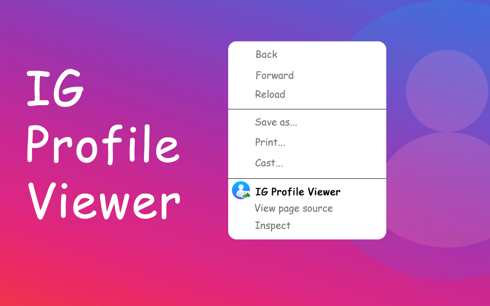

[](https://github.com/Eclipse-Walker/ig-profile-viewer/actions/workflows/update-version.yml)
[](https://github.com/Eclipse-Walker/ig-profile-viewer/actions/workflows/bump-version.yml)

## IG Profile Viewer ⭐️⭐️⭐️⭐️⭐️

IG Profile Viewer: Conveniently View & Download Instagram and TikTok Profile Pictures
If you enjoy exploring Instagram and TikTok profiles and want to see profile pictures in full size without using external tools, IG Profile Viewer is the solution you’ve been looking for!

Using IG Profile Viewer is both easy and convenient. Simply install this extension on your Chrome browser, open any Instagram or TikTok profile, and view or download its profile picture in full size with just a few clicks. This ensures you don’t miss any of the small details in important profile pictures.
  - Convenience: View or download profile pictures in full size immediately without needing additional tools.
  - Easy to Use: Quick installation and immediate functionality with no hassle.
  - No Ads: No interruptions from advertisements or special offers.

## Supported Platforms
Our extension currently supports the following platforms:
1. **Instagram**
2. **TikTok**

Stay tuned for more platforms in the future!

## How to Use
Open a profile page on a supported platform (e.g. `https://www.instagram.com/<username>` or `https://www.tiktok.com/@<username>`), then:

  - **Left-click the extension icon** in the toolbar to **download** the full-size profile picture directly.
  - **Right-click the page and choose "IG Profile Viewer"** from the context menu to **open** the full-size profile picture in a new tab.

For Instagram, the extension fetches the highest-resolution image available, automatically falling back to the public web profile picture when the high-res endpoint is unavailable (for example, on private accounts).


## Installation
Chrome Web Store [IG Profile Viewer](https://chromewebstore.google.com/detail/ig-profile-viewer/lejkiphccnemcedcpiohmojhmleigekk)

<a href="https://chromewebstore.google.com/detail/ig-profile-viewer/lejkiphccnemcedcpiohmojhmleigekk">
    
</a>



---
the Chrome extension that makes viewing Instagram and TikTok profile pictures easier and more convenient! With IG Profile Viewer, you can view or download profile pictures in full size without needing external tools

## Any API endpoint to request user info by Instagram ID?

> Use an official useragent and everything works like a charm :wink: [link](https://mpsocial.com/t/any-api-end-point-to-request-user-info-by-ig-id/86705/2)

## The User-Agent request header

```
Mozilla/5.0 (iPhone; CPU iPhone OS 12_3_1 like Mac OS X) AppleWebKit/605.1.15 (KHTML, like Gecko) Mobile/15E148 Instagram 105.0.0.11.118 (iPhone11,8; iOS 12_3_1; en_US; en-US; scale=2.00; 828x1792; 165586599)
```
---

## ⚙️How to build package
#### Grant Execution Permission
Open terminal and give execution permission to the script:

Bash `chmod +x buildscripts/build_package.sh`

#### Build Package
Run the script with the command:

Bash `bash buildscripts/build_package.sh`

---

```
 /$$$$$$$$           /$$ /$$                                       /$$      /$$           /$$ /$$                          
| $$_____/          | $$|__/                                      | $$  /$ | $$          | $$| $$                          
| $$        /$$$$$$$| $$ /$$  /$$$$$$   /$$$$$$$  /$$$$$$         | $$ /$$$| $$  /$$$$$$ | $$| $$   /$$  /$$$$$$   /$$$$$$ 
| $$$$$    /$$_____/| $$| $$ /$$__  $$ /$$_____/ /$$__  $$ /$$$$$$| $$/$$ $$ $$ |____  $$| $$| $$  /$$/ /$$__  $$ /$$__  $$
| $$__/   | $$      | $$| $$| $$  \ $$|  $$$$$$ | $$$$$$$$|______/| $$$$_  $$$$  /$$$$$$$| $$| $$$$$$/ | $$$$$$$$| $$  \__/
| $$      | $$      | $$| $$| $$  | $$ \____  $$| $$_____/        | $$$/ \  $$$ /$$__  $$| $$| $$_  $$ | $$_____/| $$      
| $$$$$$$$|  $$$$$$$| $$| $$| $$$$$$$/ /$$$$$$$/|  $$$$$$$        | $$/   \  $$|  $$$$$$$| $$| $$ \  $$|  $$$$$$$| $$      
|________/ \_______/|__/|__/| $$____/ |_______/  \_______/        |__/     \__/ \_______/|__/|__/  \__/ \_______/|__/      
                            | $$                                                                                           
                            | $$                                                                                           
                            |__/                                                                                           
```